# My progress in the course [kottans-frontend](https://github.com/kottans/frontend/tree/master/tasks) from **"Kottans"** [](https://github.com/kottans)


# 🎯done <a id="top"></a>

- [👍] <a href="#git_intro">Git and GitHub Intro</a>
- [👍] <a href="#linux_cli_http">Linux CLI, and HTTP</a>
- [👍] <a href="#git_collaboration">Git for Team Collaboration</a>
- [👍] <a href="#front_End">Intro to HTML and CSS</a>
- [👍] <a href="#responsive_Layouts">Responsive Layouts</a>
- [👍] <a href="#JavaScript Basics">JavaScript Basics</a>

# ⏳ to be done 
## Practice
- [❌] <a href="#HTML & CSS Practice">HTML & CSS Practice</a>
- [❌] <a href="#Document Object Model">Document Object Model</a>
- [❌] <a href="#Building a Tiny JS World (pre-OOP)">Building a Tiny JS World (pre-OOP)</a>
- [❌] <a href="#Object-Oriented JavaScript">Object-Oriented JavaScript </a>
- [❌] <a href="#OOP exercise">OOP exercise</a>
- [❌] <a href="#Memory – Pair Game">Memory – Pair Game </a>
- [❌] <a href="#Friends App">Friends App</a>

 # 🎯<a id="git_intro">Git and GitHub Intro </a> 
 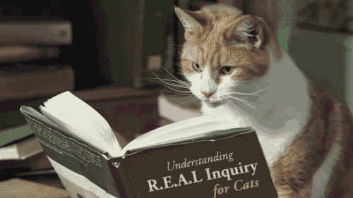

 ## 1. Finished the course [Version Control with Git](https://www.udacity.com/course/version-control-with-git--ud123):

 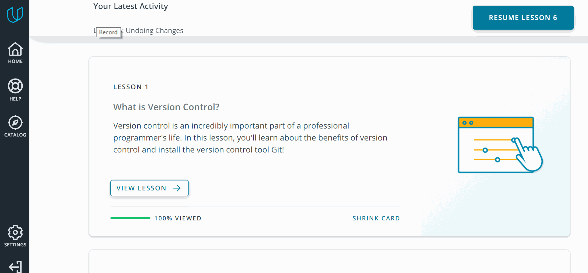

## 🔥Important commands: 

> **git status** - this command can be used quite often to check the status of a repository</br>
> **git log** - will show the entire commit history of this repository</br>
> **git log --stat** - we can see what files were modified and how many lines of code were added or removed</br>
> **git show** - find out what changes were made in a specific commit.</br>
> **git checkout** - roll back a file to a specific commit.</br>
> **git reset** - remove file from index.</br>
> **git revert** - undo the last commit.</br>
> **git commit --amend -m** - fix the last commit. For example, the commit text was added with an error.</br>
> **git checkout -b** - create a new branch (create a pointer to a commit).</br>
> **git merge --abort** - undo the merge.</br>

## 2. Complete the following levels at [learngitbranching.js.org](https://learngitbranching.js.org/?locale=ru_RU):

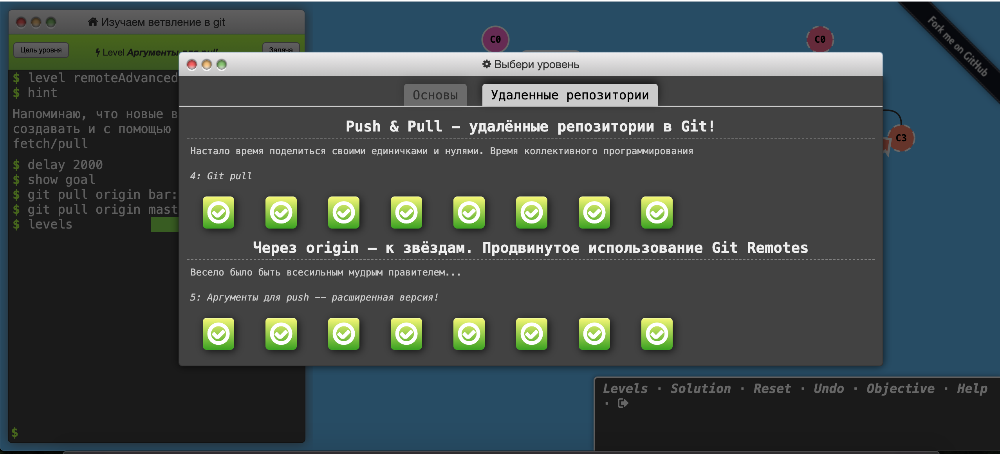

<br>

## <a href="#top">🐱GO UP☝️</a>

<br>

# 🎯<a id="linux_cli_http">Linux, Command Line, HTTP Tools</a> 


## 1. Finished the course [Linux Survival (4 modules)](https://linuxsurvival.com/linux-tutorial-quiz-2/):

|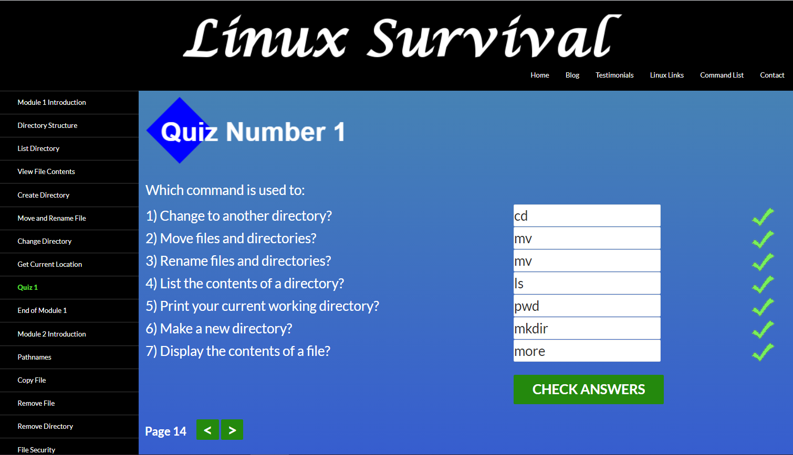 | 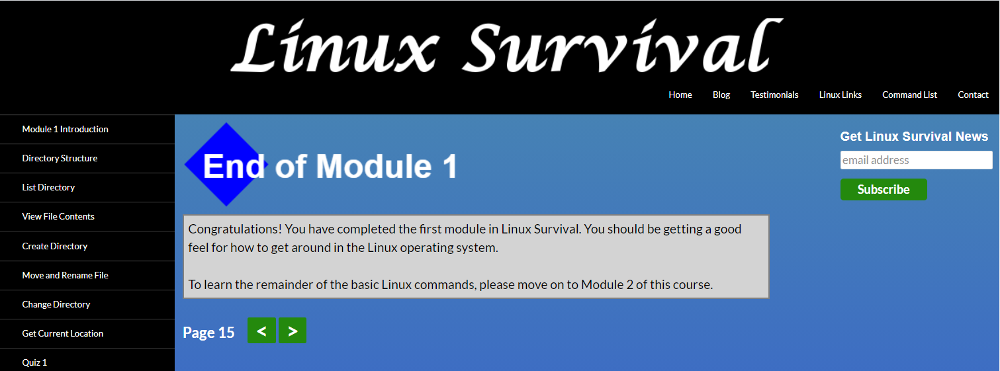    | 
|---- | ------------ | 
|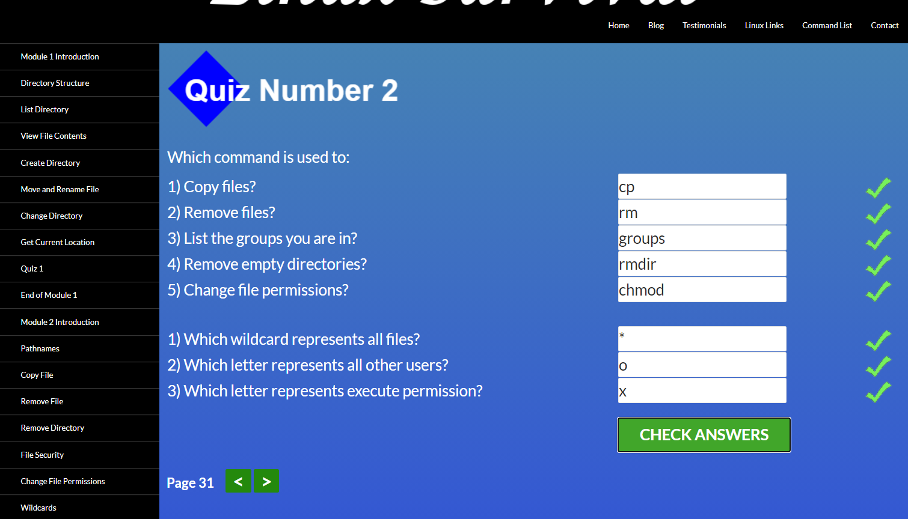 | 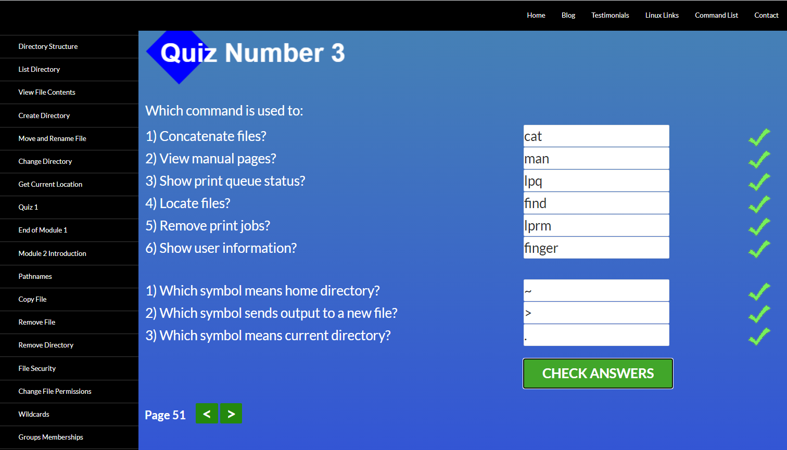      |
|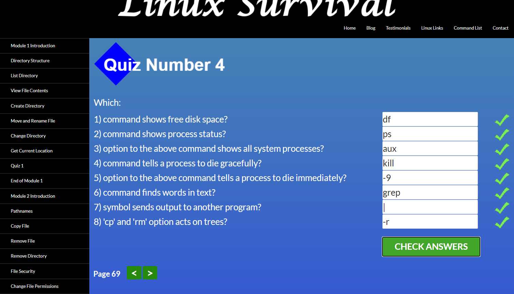  | 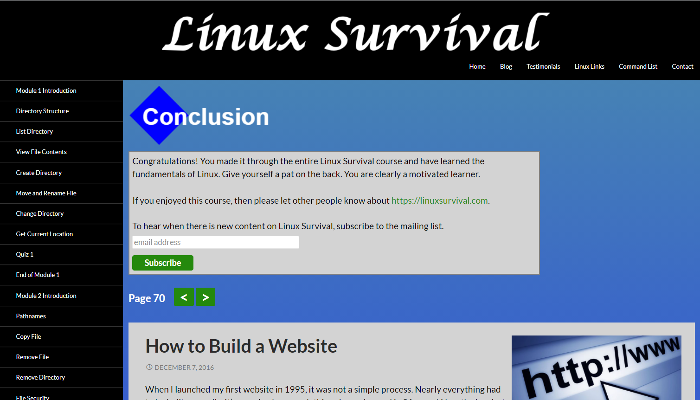  | 

## 🔥Important commands: 

> **pwd command** - use the pwd command to find out the path of the current working directory</br>
> **cd command** - to navigate through the Linux files and directories</br>
> **ls command** - the ls command is used to view the contents of a directory</br>
> **cat command** - cat (short for concatenate) is one of the most frequently used commands in Linux. It is used to list the contents of a file on the standard output (sdout). To run this command, type cat followed by the file’s name and its extension. For instance: cat file.txt.</br>
> **cp command** - use the cp command to copy files from the current directory to a different directory.</br>
> **mv command** - the primary use of the mv command is to move files, although it can also be used to rename files.</br>
> **mkdir command** - use mkdir command to make a new directory — if you type mkdir Music it will create a directory called Music.</br>
> **rmdir command** - if you need to delete a directory, use the rmdir command.</br>
> **rm command** - the rm command is used to delete directories and the contents within them. If you only want to delete the directory — as an alternative to rmdir — use rm -r.</br>
> **grep command** - another basic Linux command that is undoubtedly helpful for everyday use is grep. It lets you search through all the text in a given file.</br>
> **df command** - Use df command to get a report on the system’s disk space usage, shown in percentage and KBs. If you want to see the report in megabytes, type df -m.</br>
> **kill command** - if you have an unresponsive program, you can terminate it manually by using the kill command. It will send a certain signal to the misbehaving app and instructs the app to terminate itself.</br>
## 2. [HTTP: The Protocol Every Web Developer Must Know - Part 1](https://code.tutsplus.com/tutorials/http-the-protocol-every-web-developer-must-know-part-1--net-31177):

> HTTP stands for Hypertext Transfer Protocol. It's a stateless, application-layer protocol for communicating between distributed systems, and is the foundation of the modern web

|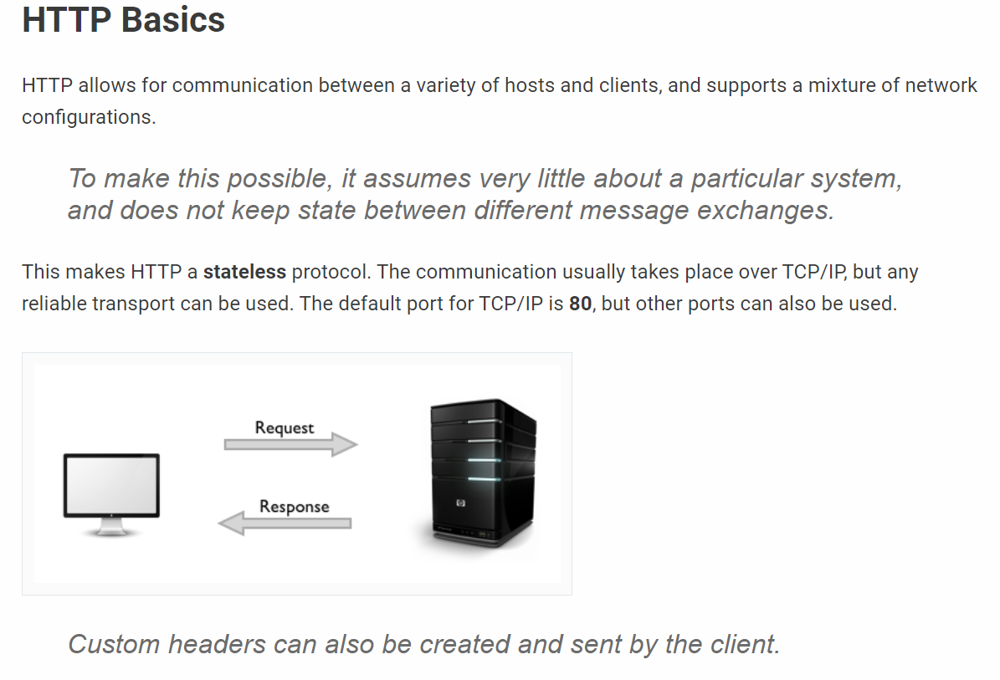 | 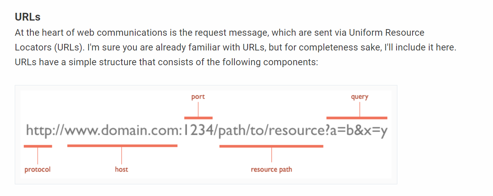    | 
|---- | ------------ | 

## 3. [HTTP: The Protocol Every Web Developer Must Know - Part 2](https://code.tutsplus.com/tutorials/http-the-protocol-every-web-developer-must-know-part-2--net-31155):
> HTTP Connections
A connection must be established between the client and server before they can communicate with each other, and HTTP uses the reliable TCP transport protocol to make this connection. By default, web traffic uses TCP port 80. A TCP stream is broken into IP packets, and it ensures that those packets always arrive in the correct order without fail. HTTP is an application layer protocol over TCP, which is over IP.

|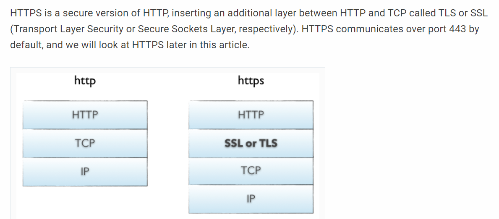 | 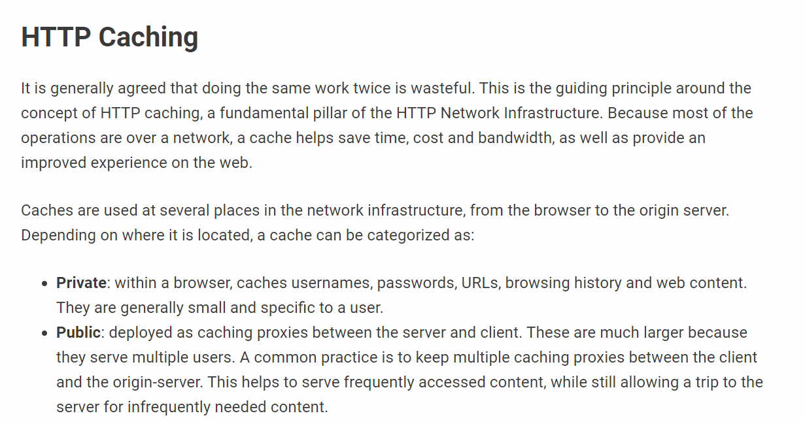    | 
|---- | ------------ | 
<br>

## <a href="#top">🐱GO UP☝️</a>

<br>

 # 🎯<a id="git_collaboration">Git for Team Collaboration</a> 
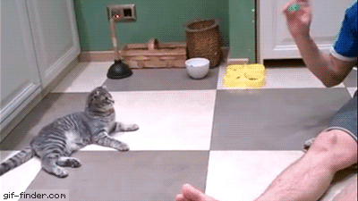

## 1. Finished the course [Complete the following](https://classroom.udacity.com/courses/ud456):
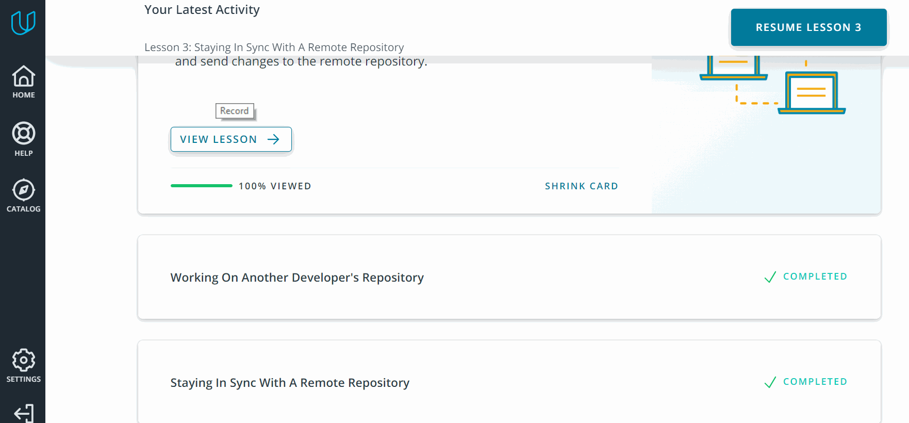

## 🔥Important commands: 

> **git remote** - will display the names of available remote repositories<br>
> **git fetch [remote-name]** - this command connects with the specified remote project and takes all the project data that you do not have yet. After you have executed the command, you should have links to all branches from this remote project, which you can view or merge at any time.<br>
> **git pull** - typically fetch data from the server you originally cloned from and automatically tries to merge it with the code you are currently working on.<br>
> **git push origin master** - this command only fires if you cloned from a server where you have write permissions and if no one else has performed the push command since then.<br>
> **git remote show origin** - it gives the URL of the remote repository as well as information about the branches being tracked.<br>
> **git shortlog** - how many commits each contributor has added to the repository is to use this command.<br>
> **git log --author="name"** - to filter the commits to the provided author<br>
<br>

## <a href="#top">🐱GO UP☝️</a>

<br>

# 🎯<a id="front_End">Intro to HTML and CSS</a>


## 1. Finished the course [Intro to HTML and CSS](https://www.udacity.com/course/intro-to-html-and-css--ud001):
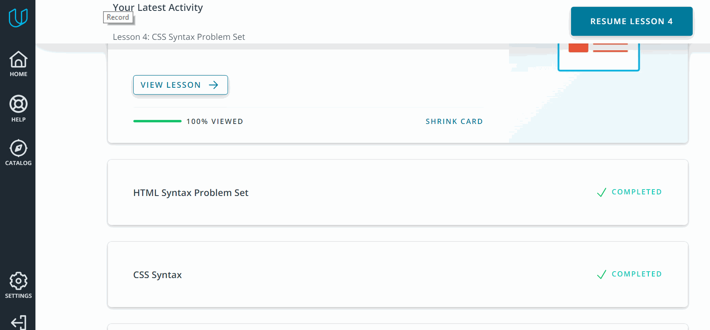 

## 2. Finished the course [Learn HTML(Eng)](https://www.codecademy.com/learn/learn-html):
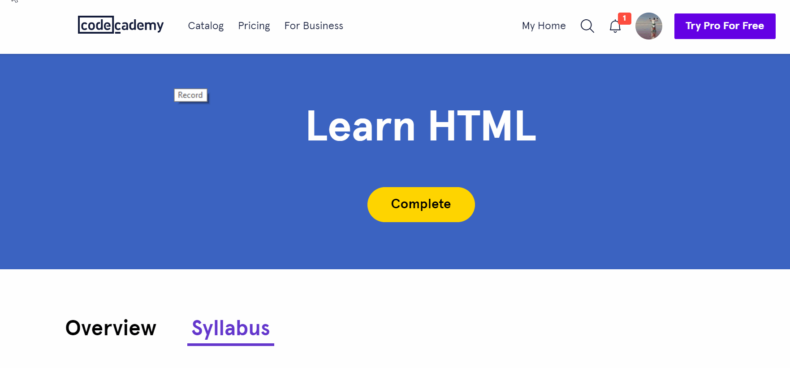 

## 3. Finished the course [Learn CSS(Eng)](https://www.codecademy.com/learn/learn-css):
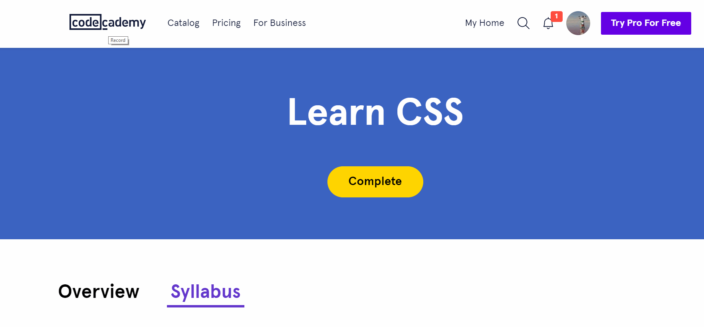 

## 🔥Important information: 

> 1. **`<teg form>`:** <br>
> * The purpose of a `<teg form>` is to allow users to input information and send it.<br>
> * The `<teg form>`s action attribute determines where the form’s information goes.<br>
> * The `<teg form>`s method attribute determines how the information is sent and processed.<br>
> * To add fields for users to input information we use the <input> element and set the type attribute to a field of our choosing.<br>
> * A `<select>` element is populated with`<option>` elements and renders a dropdown list selection.<br>
> * A `<datalist>` element is populated with `<option>` elements and works with an `<input>` to search through choices.<br>
> * A `<textarea>` element is a text input field that has a customizable area.<br>
> * When a `<form>` is submitted, the name of the fields that accept input and the value of those fields are sent as name=value pairs.<br>
> 2. **`CSS Transitions:`** 
>  CSS Transitions are a powerful tool for providing visual feedback to users.<br>
> Weve learned a lot about transitions, so let’s review:
CSS Transitions have 4 components:<br>
> * A *property* that will transition.<br>
> * The *duration* which describes how long the transition takes.<br>
> * The *delay* to pause before the transition will take place.<br>
> * The *timing function* that describes the transition’s acceleration.<br>
> * Many properties’ state changes can be transitioned, including color, background color, font size, width, and height. all is also a valid transition property that causes every changing property to transition.
<br>

## <a href="#top">🐱GO UP☝️</a>

<br>

# 🎯<a id="responsive_Layouts">Responsive Web Design</a>


## 1. Finished the course [Responsive Web Design Fundamentals](https://www.udacity.com/course/responsive-web-design-fundamentals--ud893):
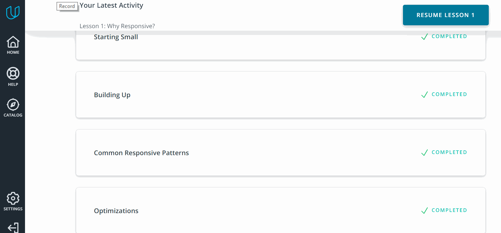 

## 2. Finished [Flexbox Froggy](http://flexboxfroggy.com/#ru):
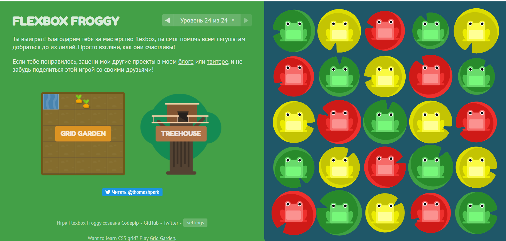 
## 🔥Important information: 

> 1. **Responsive:** <br>
> * `<teg meta>`<br>
>Example:<br>
>```<meta name="viewport" content="width=device-width, initial-scale=1.0">```<br>
> * @*media query*:<br>
>Media queries based on viewport size.<br>
>Media queries enable us to create a responsive experience where specific styles are applied to small screens, large screens, and anywhere in between.<br>
> The feature we are detecting here is therefore screen size, and we can test for the following things.<br>
> - * width (min-width, max-width)<br>
> - * height (min-height, max-height)<br>
> - * orientation<br>
> - * aspect-ratio<br>
>
> A media query consists of a media type and can contain one or more expressions, which resolve to either true or false.<br>
> Example:<br>
> `@media screen and (min-width: 480px) {
        body {
        background-color: lightgreen;
        }`
><br>
> * `<teg img>`<br>
>Example:<br>
>`img {
>  max-width: 100%;
>  display: block;
>   }`
><br>
> 2. **flexbox:** <br>
> * flex-direction ⬅️➡️:<br>
> - * row <br>
> - * row-reverse<br>
> - * column<br>
> - * column-reverse<br>
> * *align-items* - property will align the items on the cross axis:<br>
> - * stretch <br>
> - * flex-start<br>
> - * flex-end<br>
> - * center<br>
>* *justify-content* - property is used to align the items on the main axis, the direction in which flex-direction has set the flow:<br>
> - * flex-start <br>
> - * flex-end<br>
> - * center<br>
> - * space-around<br>
> - * space-between<br>
> - * space-evenly<br>
<br>
## <a href="#top">🐱GO UP☝️</a>
<br>

# 🎯<a id="javaScript_basics">JavaScript Basics</a>


## 1. Finished the course [Intro to JS](https://classroom.udacity.com/courses/ud803):

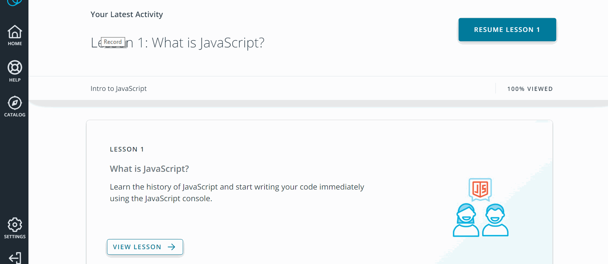 

## 2. Finished the FreeCodeCamp exercises
   - [Basic JavaScript](https://www.freecodecamp.org/learn):
   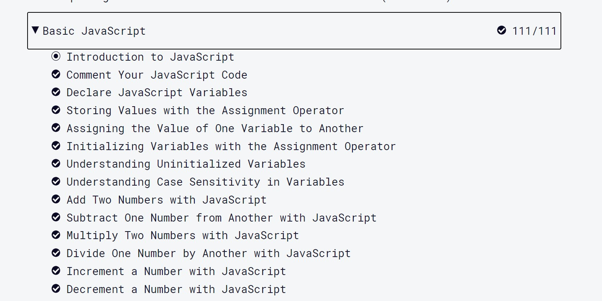
   
   - [ES6 Challenges](https://www.freecodecamp.org/learn):