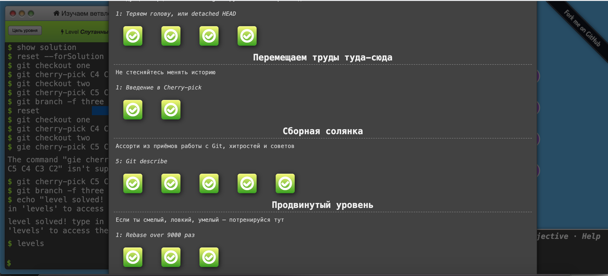

## My progress in the course [kottans-frontend](https://github.com/kottans/frontend/tree/master/tasks) from **"Kottans"** 

# 🎯done 

- [👍] <a href="#git_intro">Git and GitHub Intro</a>
- [👍] <a href="#linux_cli_http">Linux CLI, and HTTP</a>
- [👍] <a href="#git_collaboration">Git Collaboration</a>

# ⏳ to be done 

##  Front-End Basics
- [❌] <a href="#git_intro">Intro to HTML & CSS (Eng)</a>
- [❌] <a href="#linux_cli_http">Learn HTML(Eng)</a>
- [❌] <a href="#git_collaboration">Learn CSS(Eng)</a>
- [❌] <a href="#git_collaboration">JavaScript Basics</a>
- [❌] <a href="#git_collaboration">Responsive Layouts</a>
## Practice
- [❌] <a href="#git_intro">HTML & CSS Practice</a>
- [❌] <a href="#linux_cli_http">Document Object Model</a>
- [❌] <a href="#linux_cli_http">Building a Tiny JS World (pre-OOP)</a>
- [❌] <a href="#linux_cli_http">Object-Oriented JavaScript </a>
- [❌] <a href="#linux_cli_http">OOP exercise</a>
- [❌] <a href="#linux_cli_http">Memory – Pair Game </a>
- [❌] <a href="#linux_cli_http">Friends App</a>

 # 🎯<a href="#git_intro">Git and GitHub Intro </a> 
 

 ## 1. Finished the course [Version Control with Git](https://www.udacity.com/course/version-control-with-git--ud123):

 

## 🔥Important commands: 

> **git status** - this command can be used quite often to check the status of a repository 
> **git log** - will show the entire commit history of this repository 
> **git log --stat** - we can see what files were modified and how many lines of code were added or removed 
> **git show** - find out what changes were made in a specific commit. 
> **git checkout** - roll back a file to a specific commit. 
> **git reset** - remove file from index. 
> **git revert** - undo the last commit. 
> **git commit --amend -m** - fix the last commit. For example, the commit text was added with an error. 
> **git checkout -b** - create a new branch (create a pointer to a commit). 
> **git merge --abort** - undo the merge. 

## 2. Complete the following levels at [learngitbranching.js.org](https://learngitbranching.js.org/?locale=ru_RU):

# 🎯<a href="#git_intro">Linux, Command Line, HTTP Tools</a> 

## 1. Finished the course [Linux Survival (4 modules)](https://linuxsurvival.com/linux-tutorial-quiz-2/):

| |     | 
|---- | ------------ | 
| |       |
|  |   | 

## 🔥Important commands: 

> **pwd command** - use the pwd command to find out the path of the current working directory 
> **cd command** - to navigate through the Linux files and directories 
> **ls command** - the ls command is used to view the contents of a directory 
> **cat command** - cat (short for concatenate) is one of the most frequently used commands in Linux. It is used to list the contents of a file on the standard output (sdout). To run this command, type cat followed by the file’s name and its extension. For instance: cat file.txt. 
> **cp command** - use the cp command to copy files from the current directory to a different directory. 
> **mv command** - the primary use of the mv command is to move files, although it can also be used to rename files. 
> **mkdir command** - use mkdir command to make a new directory — if you type mkdir Music it will create a directory called Music. 
> **rmdir command** - if you need to delete a directory, use the rmdir command. 
> **rm command** - the rm command is used to delete directories and the contents within them. If you only want to delete the directory — as an alternative to rmdir — use rm -r. 
> **grep command** - another basic Linux command that is undoubtedly helpful for everyday use is grep. It lets you search through all the text in a given file. 
> **df command** - Use df command to get a report on the system’s disk space usage, shown in percentage and KBs. If you want to see the report in megabytes, type df -m. 
> **kill command** - if you have an unresponsive program, you can terminate it manually by using the kill command. It will send a certain signal to the misbehaving app and instructs the app to terminate itself. 
## 2. [HTTP: The Protocol Every Web Developer Must Know - Part 1](https://code.tutsplus.com/tutorials/http-the-protocol-every-web-developer-must-know-part-1--net-31177):

> HTTP stands for Hypertext Transfer Protocol. It's a stateless, application-layer protocol for communicating between distributed systems, and is the foundation of the modern web

| |     | 
|---- | ------------ | 

## 3. [HTTP: The Protocol Every Web Developer Must Know - Part 2](https://code.tutsplus.com/tutorials/http-the-protocol-every-web-developer-must-know-part-2--net-31155):
> HTTP Connections
A connection must be established between the client and server before they can communicate with each other, and HTTP uses the reliable TCP transport protocol to make this connection. By default, web traffic uses TCP port 80. A TCP stream is broken into IP packets, and it ensures that those packets always arrive in the correct order without fail. HTTP is an application layer protocol over TCP, which is over IP.

| |     | 
|---- |-----
||

